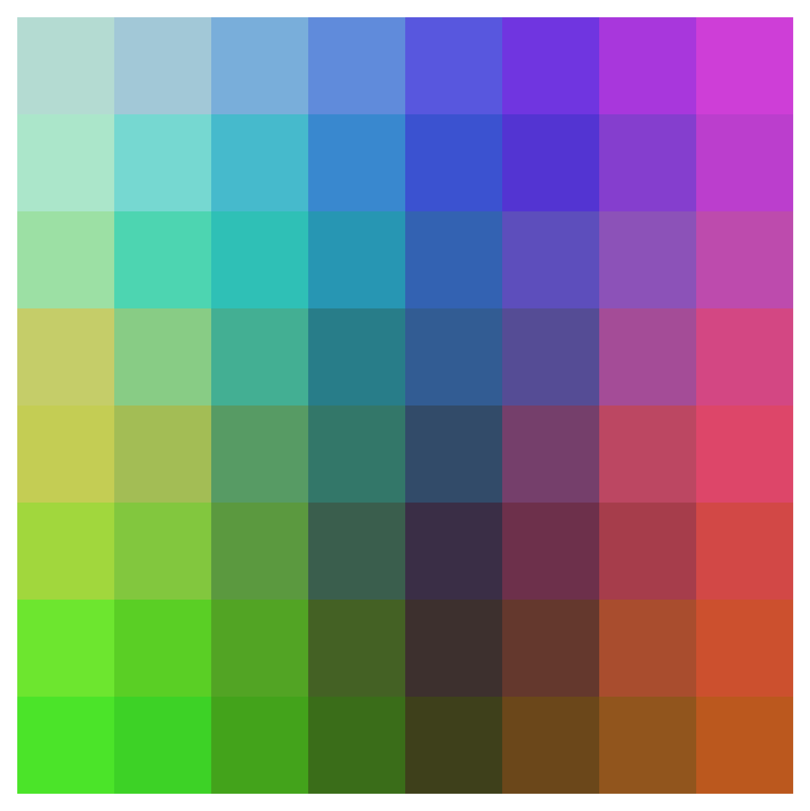
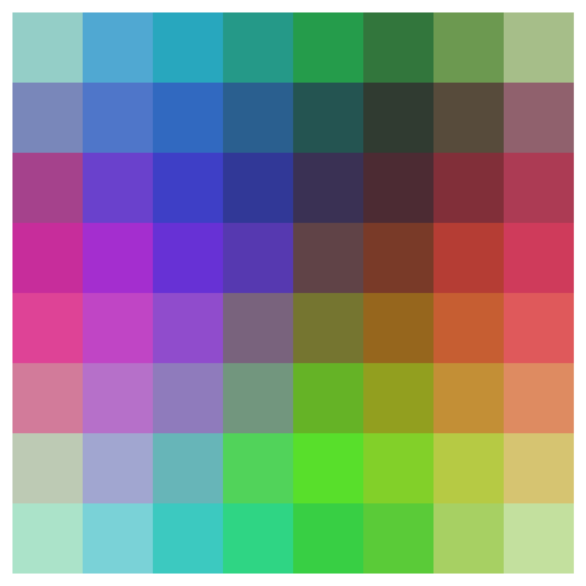
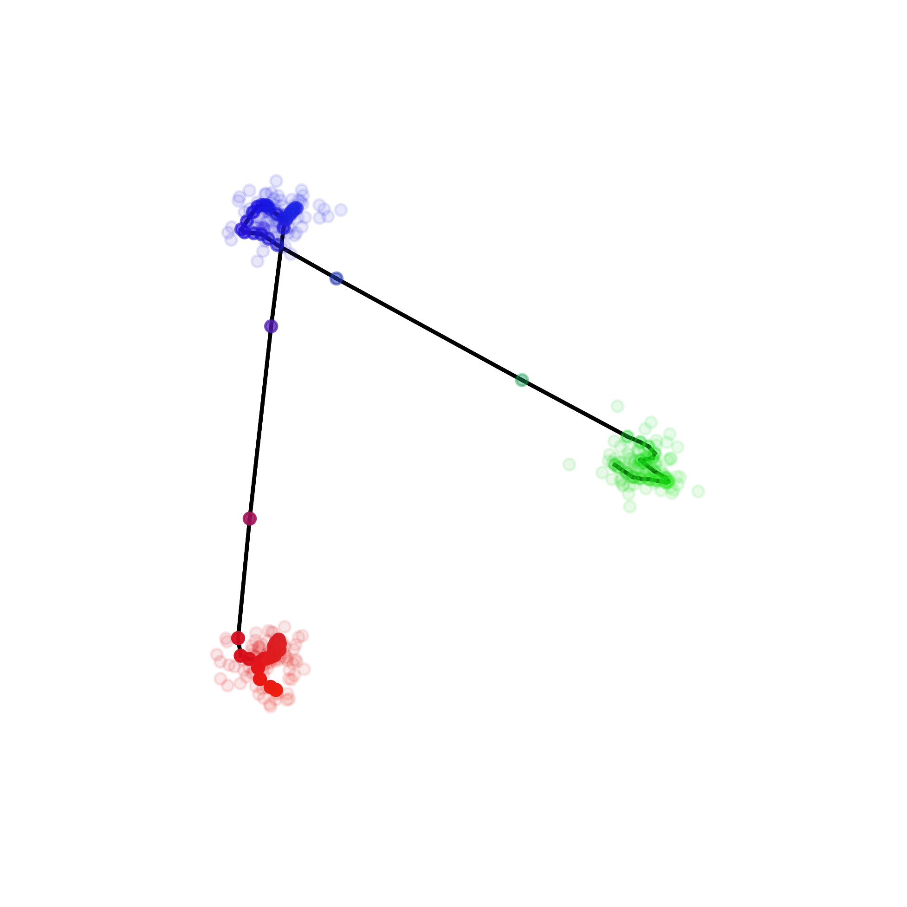
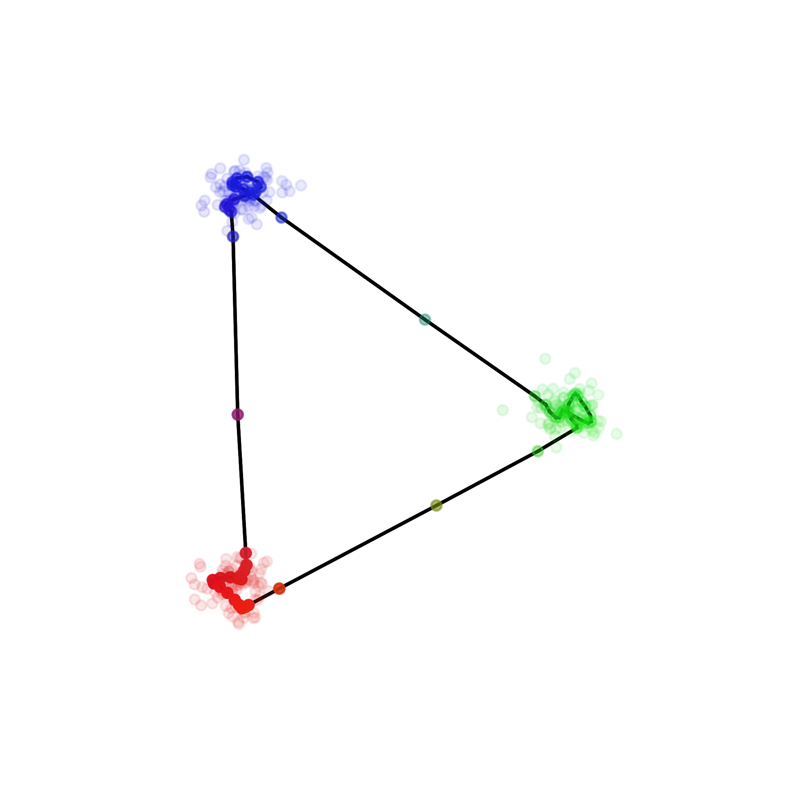
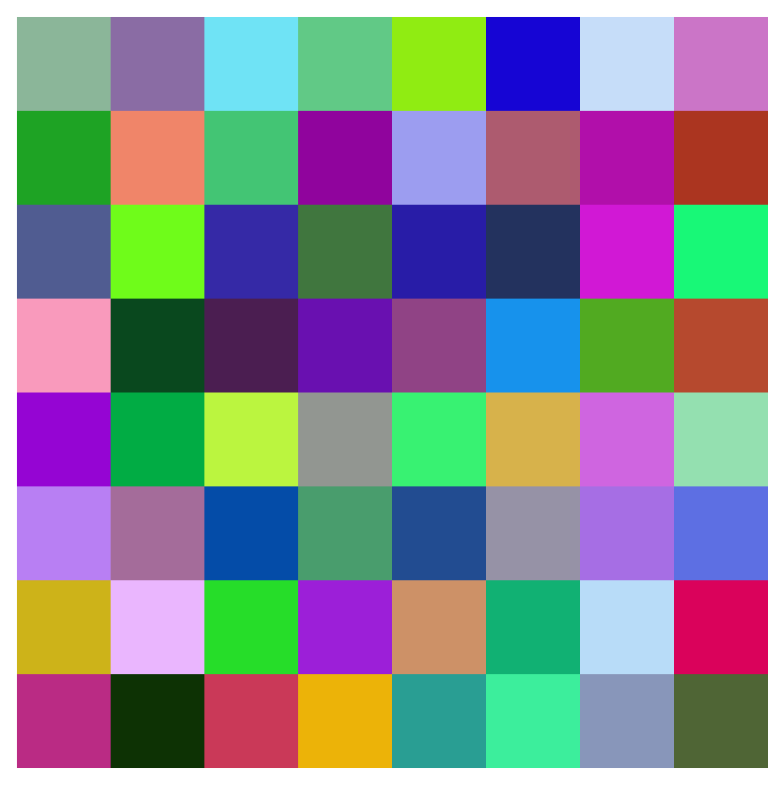
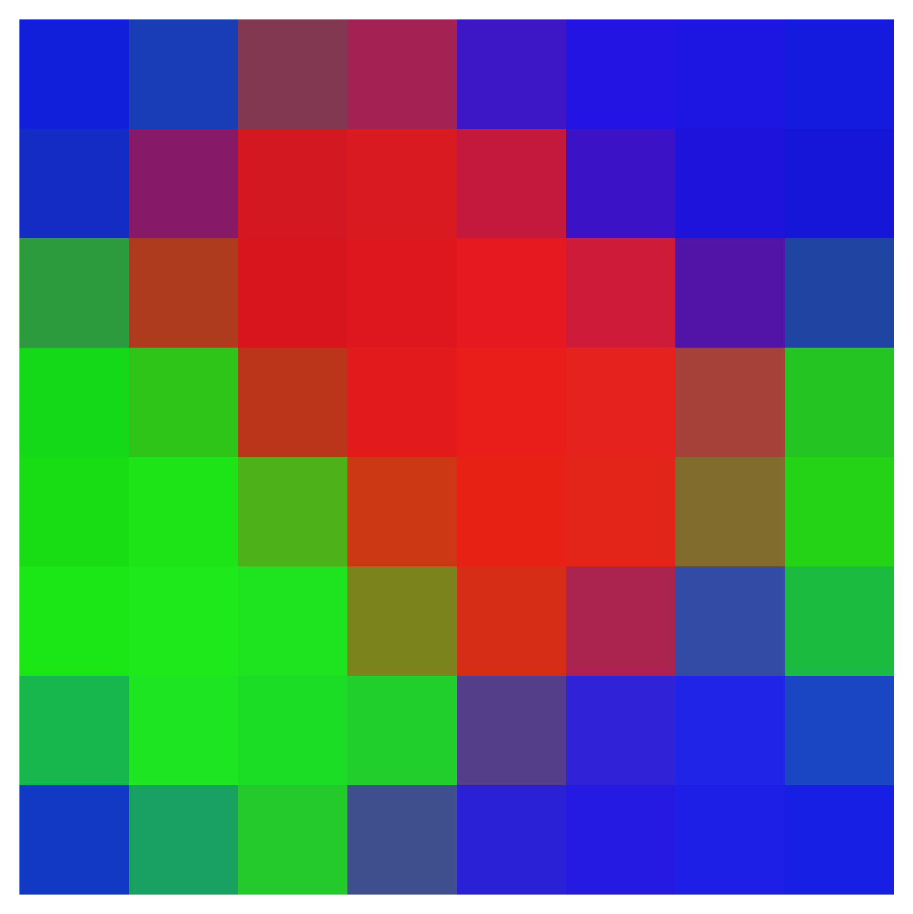
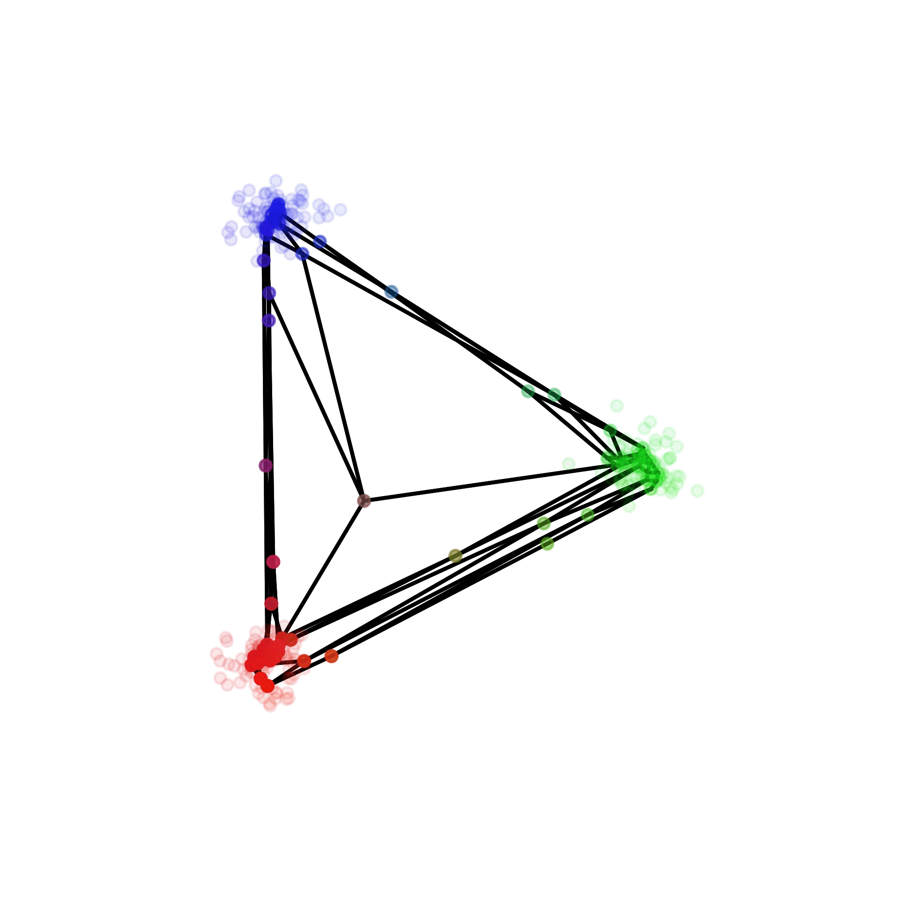
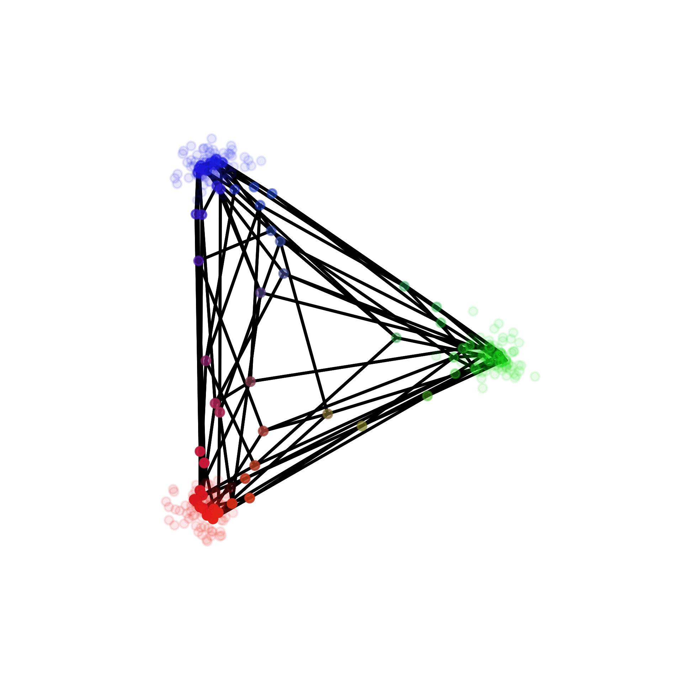
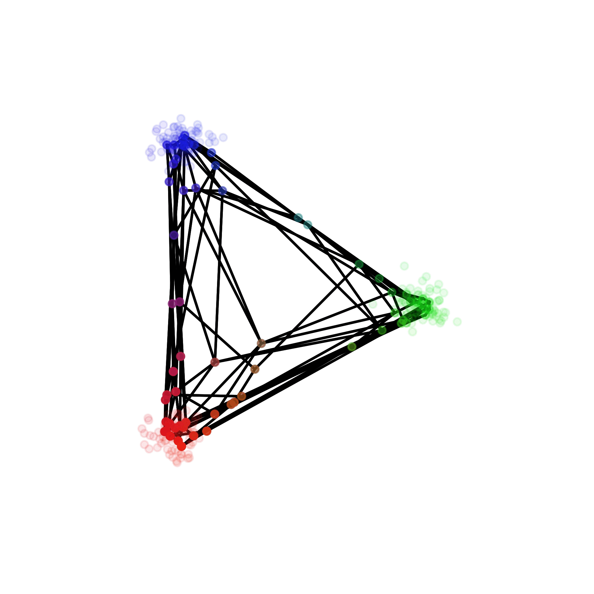
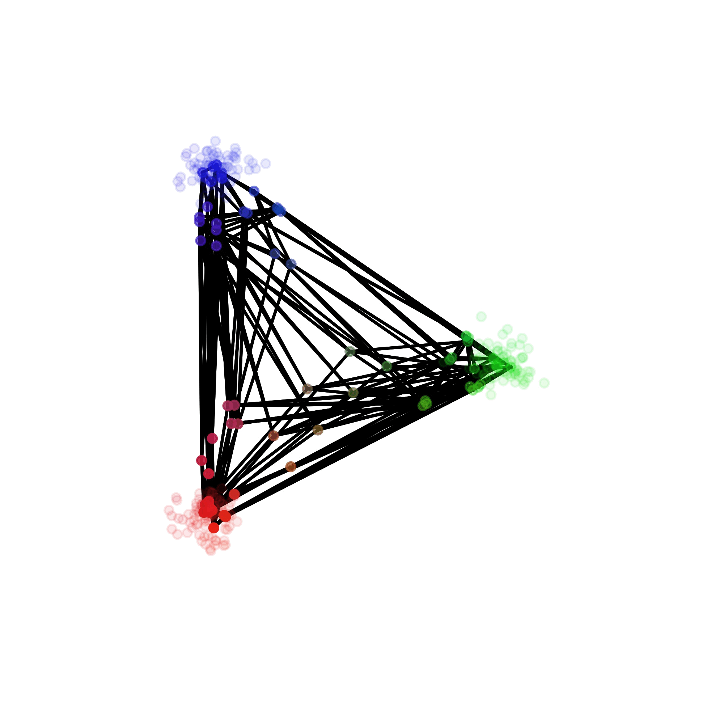

# py-self-organizing-maps



## Simple implementation of self-organizing maps (SOMs)
A [SOM](https://en.wikipedia.org/wiki/Self-organizing_map) is an unsupervised method for learning a mapping from a discrete topology to a data space. The SOM method assigns to each node of this graph a feature weight vector corresponding to a vector/position in the data space. Over the course of iterations, the node weights of this topology are learned to cover the distribution of samples in the dataset, providing a discrete map over the manifold of the data while encouraging local continuity through the topology. Through determining nearest neighbor node weights to a given data sample, the learned mapping is approximately invertible by basically performing quantization.


## The code

This implementation is split into two major parts: An abstract ```Topology``` class and the ```SelfOrganizingMap``` class. The first one is basically an interface to define a topology. Currently, topologies are defined via the abstract ```metric(...)``` and ```get_neighbors_of_node(...)``` methods. In addition to that, one can instantiate the abstract plotting methods ```plot_map(...)```, ```plot_nodes(...)```, or ```plot_node_difference_map(...)``` to define how the topology can be plotted via matplotlib.

There is already one, arguably the simplest form of topology, implemented, namely regular one-, two- or three-dimensional grid structures as a ```GridTopology``` subclass.

The second class handles everything related to the iterative learning process and has an ```self.topology``` attribute which is an instance of the other class. It provides a simple ```fit()``` method for training and wrapper methods for plotting.

The plotting methods are currently somewhat specialised to the color space example scenario. Feel free to play around with other topologies and other visualisations.


## How to use

```python
from som.topologies import GridTopology
from som import SelfOrganizingMap
import numpy as np

# create a random set of RGB color vectors
N = 1000
X = np.random.randint(0, 255, (N, 3)) # shape = (number_of_samples, feature_dim)

# create the SOM and fit it to the color vectors
topo = GridTopology(height=8, width=8, depth=8, d=2, periodic=False) # d is either 1 or 2 or 3
som = SelfOrganizingMap(topology=topo)
som.fit(X)

# plot the learned map, the nodes in the data space and the node differences
som.plot_map()
som.plot_nodes()
som.plot_differences_map()

```
## Examples

For demonstration purposes, ```64``` nodes were learned with an 1D-, 2D-, and 3D- ```GridTopology``` with once full and once no periodicity each on two different datasets: uniformly sampled RGB color vectors and a set that contains three gaussian blobs of data around the R, G and B color axes. 

### Uniform - 1D


### Uniform - 2D


### Uniform - 3D


### Blobs - 1D




### Blobs - 2D




### Blobs - 3D





### TODOS
- [x] Initial commit
- [ ] Add comments and documentation
- [ ] Add alternative (image) plotting methods
- [ ] Add hexagonal topology
- [ ] Add other dataset examples (e.g. MNIST, face dataset, ...)
- [ ] Use PyTorch for GPU
