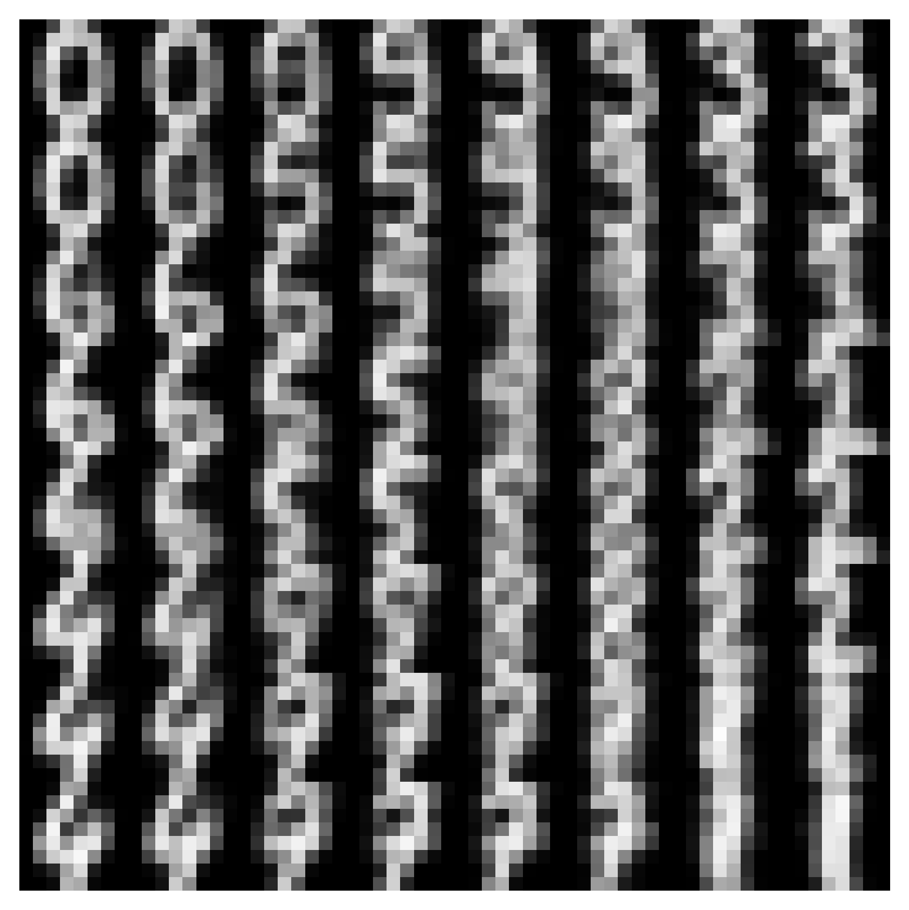
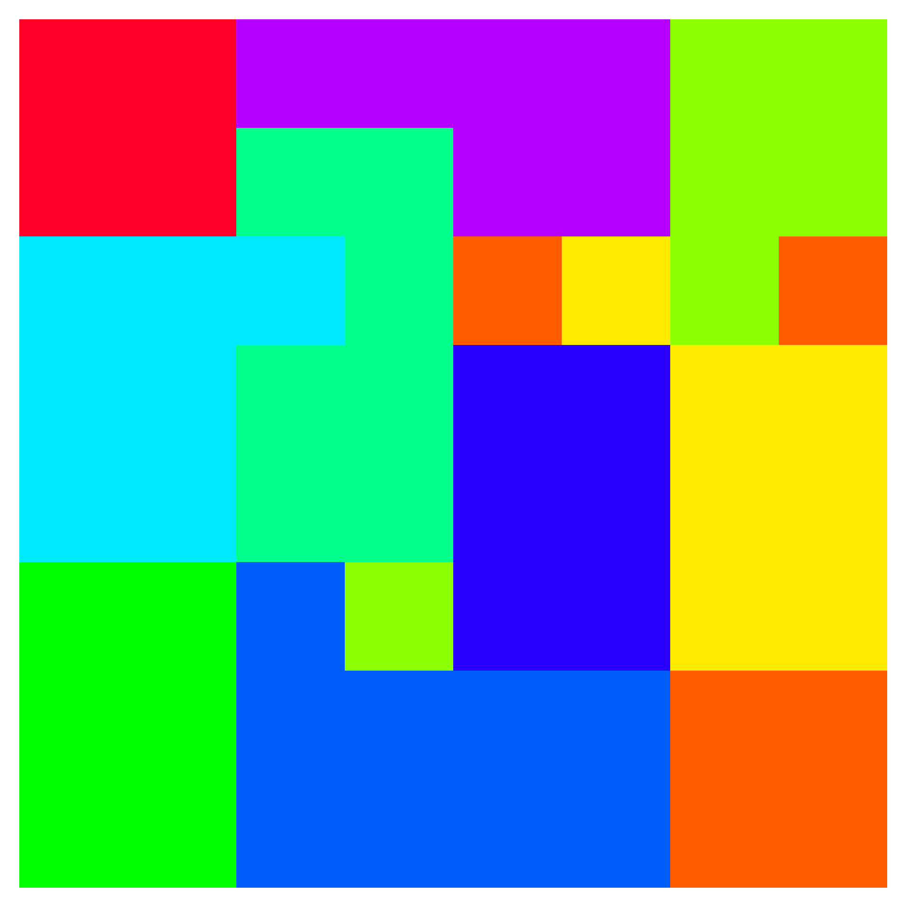
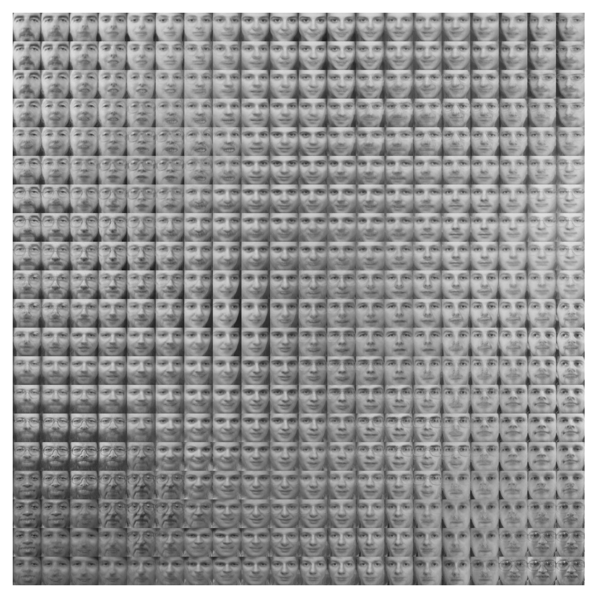
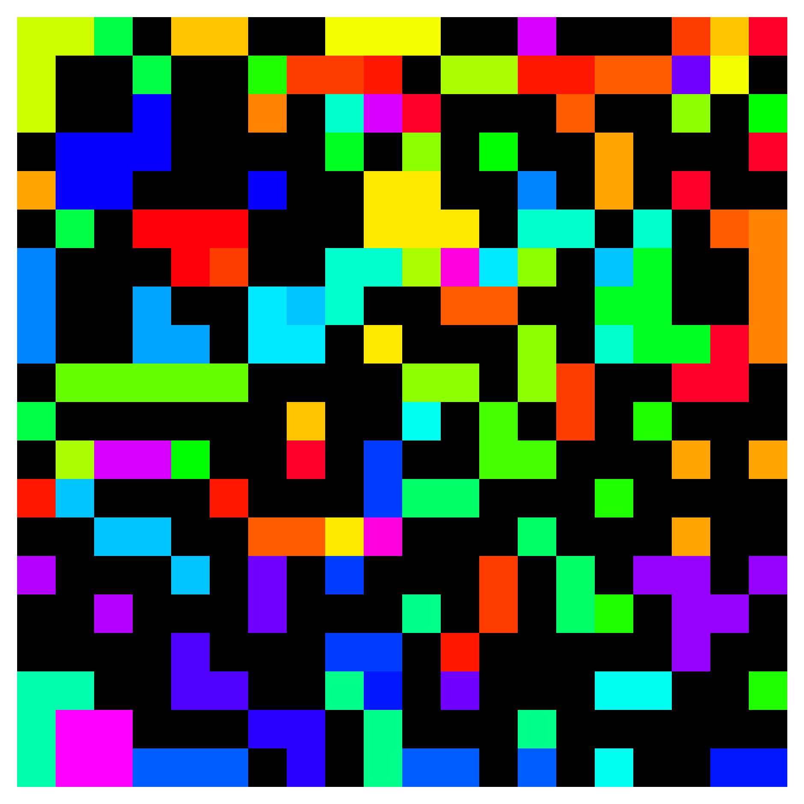
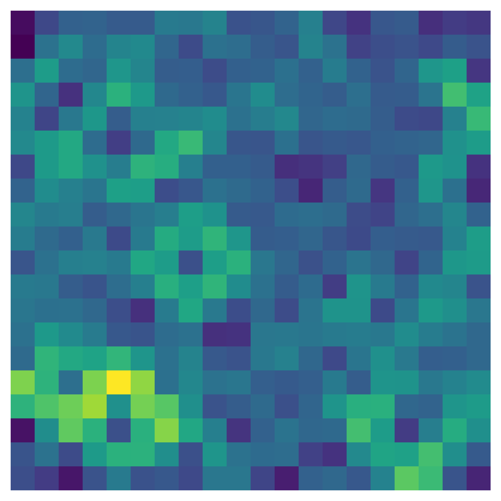

# py-self-organizing-maps


## Simple implementation of self-organizing maps (SOMs)
A [SOM](https://en.wikipedia.org/wiki/Self-organizing_map) is an unsupervised method for learning a mapping from a discrete topology to a data space. The SOM method assigns to each node of this graph a feature weight vector corresponding to a vector/position in the data space. Over the course of iterations, the node weights of this topology are learned to cover the distribution of samples in the dataset, providing a discrete map over the manifold of the data while encouraging local continuity through the topology. Through determining nearest neighbor nodes to a given data sample in the data space, the learned mapping is approximately invertible.


## The code

This implementation is split into two major parts: An abstract ```Topology``` class and the ```SelfOrganizingMap``` class. The first one is basically an interface to define a topology. Currently, topologies are defined via the abstract ```metric(...)``` and ```get_neighbors_of_node(...)``` methods. In addition to that, one can instantiate the abstract plotting methods ```plot_map(...)``` and ```plot_nodes(...)``` to define how the topology can be plotted via matplotlib.

There is already one, arguably the simplest form of topology, implemented, namely regular one-, two- or three-dimensional grid structures as a ```GridTopology``` subclass.

The second class handles everything related to the iterative learning process and has an ```self.topology``` attribute which is an instance of the other class. It provides a simple ```fit()``` method for training and wrapper methods for plotting.

**Topologies**: ```GridTopology```

**Metrics**: ```euclidian```, ```manhattan```, ```infinity```

**Neighborhood Functions**: ```gaussian```, ```triangle```, ```step```

**Error Metrics**: ```quantization_error```, ```topological_error```

**Plot Types**: ```map```, ```umap```, ```class_representation_map```, ```nodes``` (only for 3D data currently)


## How to use

```python
from som.topologies import GridTopology
from som import SelfOrganizingMap
import numpy as np

# create a random set of RGB color vectors
N = 1000
X = np.random.randint(0, 255, (N, 3)) # shape = (number_of_samples, feature_dim)

# create the SOM and fit it to the color vectors (d is either 1 or 2 or 3)
topo = GridTopology(height=4, width=4, depth=4, d=3, periodicities=[False, False, False])
som = SelfOrganizingMap(topology=topo, metric='euclidian')
som.fit(X)

# plot the learned map, the nodes in the data space and the node differences
som.plot_map()
som.plot_nodes()
som.plot_unified_distance_map()

# som.plot_class_representation_map(y, colors) # if labels and associated colors are available

```
Please have a look at the ```main.py``` for more code examples with other datasets.

## The Types of Plots
**First**: The learned node vectors (interpreted as images) on the _topology map_. **Second**: The _class representation map_, that is, the color of the majority class among the data samples that are nearer to the respective node than to any other. The black nodes have not been assigned any nearest-neighbor data points. **Third**: The _unified distance map_, which visualizes the average metric distance value from a node to its direct topology neighbors.
**Note**: These three plot types are currently available for (almost) any kind of (image) data. In order to plot the learned node weights in the data space, the data space has to have a dimensionality of smaller than or equal to 3. So far only 3D _data space plots with nodes_ are supported (**Fourth**). Animation by rotation is available for any 3D plot (just provide the ```animate=True``` argument to e.g. ```plot_map(...)``` or the ```rotate=True``` argument to the ```fit_animate(...)``` method).



## Additional Examples
**First row**: 1D grid topology without and with periodicity along the axis on uniform color sample dataset.
**Second row**: 2D grid topology without and with periodicity along the first axis on the same dataset.
**Third row**: 3D grid topology without periodicity on the same dataset and 1D grid topology on three-cluster color dataset with periodicity.
**Note**: The 1D grid topology maps were "spiralized" to a 2D grid for better visualization.


### TODOS
- [x] Initial commit
- [ ] Add comments and documentation
- [x] Add alternative (image) plotting methods
- [ ] Add hexagonal topology
- [x] Add other dataset examples (e.g. MNIST, face dataset, ...)
- [ ] Use PyTorch for GPU
