# py-self-organizing-maps

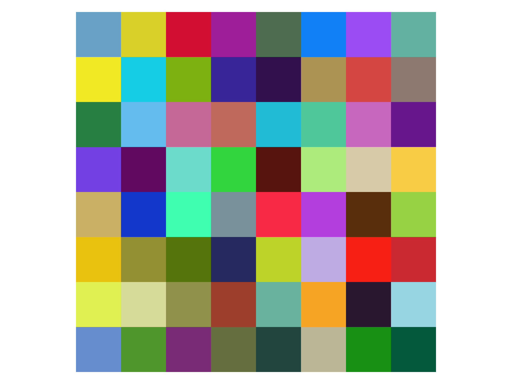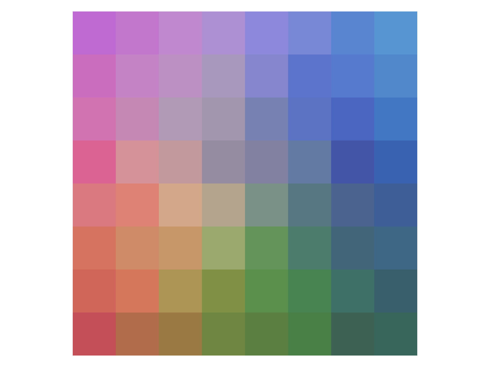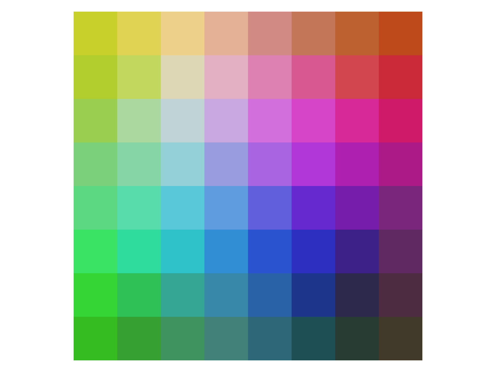


### Simple implementation of self-organizing maps (SOMs)
A [SOM](https://en.wikipedia.org/wiki/Self-organizing_map) is an unsupervised method for learning a mapping from a discrete
neighborhood-based topology to a data space. This topology is implicitly given as a neighborhood graph. The SOM method assigns to each node of this graph a feature weight
vector corresponding to a vector/position in the data space. Over the course of iterations, the node weights of this topology are learned to cover the
distribution of samples in the dataset, providing a discrete map over the manifold of the data. Through determining nearest neighbor node weights to a given data sample, the learned mapping is approximately invertible by basically performing quantization.


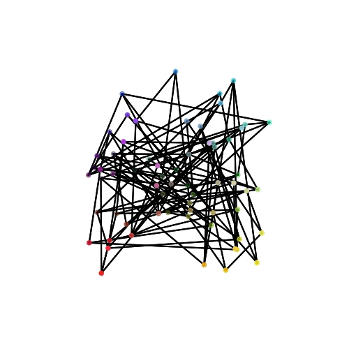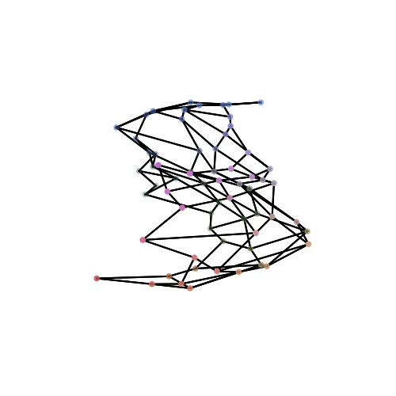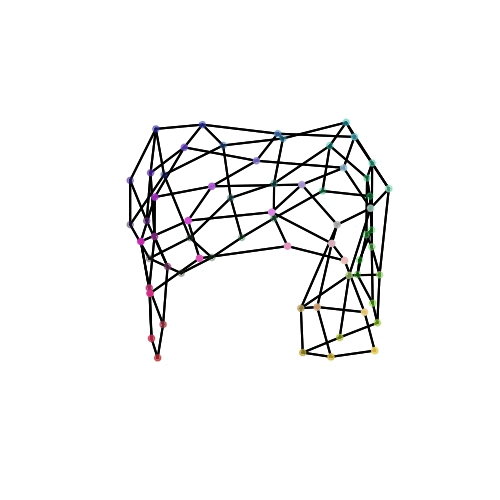

### The code

This implementation is split into two major parts: An abstract ```Topology``` class and the ```SelfOrganizingMap``` class. The first one is basically an interface to define
a neighborhood-based topology, hence it holds methods such as ```get_neighbors_of_node(...)``` or ```metric(...)``` or even abstract plotting methods such as ```plot_map(...)```.
There is already one, arguably the simplest form of topology, implemented, namely regular one-, two- or three-dimensional grid structures as a ```GridTopology``` subclass.

The second class handles everything related to the iterative learning process and has an ```self.topology``` attribute which is an instance of the other class. It provides a simple ```fit()``` method for training
and wrapper methods for plotting.

The plotting methods are currently somewhat specialised to the color space example scenario. Feel free to play around with other topologies and other visualisations.


### How to use

```python
from som import SelfOrganizingMap
from som import GridTopology

# create a random set of RGB color vectors
N = 1000
X = np.random.randint(0, 255, (N, 3)) # shape = (number_of_samples, feature_dim)

# create the SOM and fit it to the color vectors
topo = GridTopology(height=8, width=8, depth=8, d=2) # d is either 1 or 2 or 3
som = SelfOrganizingMap(topology=topo)
som.fit(X)

# plot the learned map, the nodes in the data space and the node differences
som.plot_map()
som.plot_nodes()
som.plot_differences_map()

```
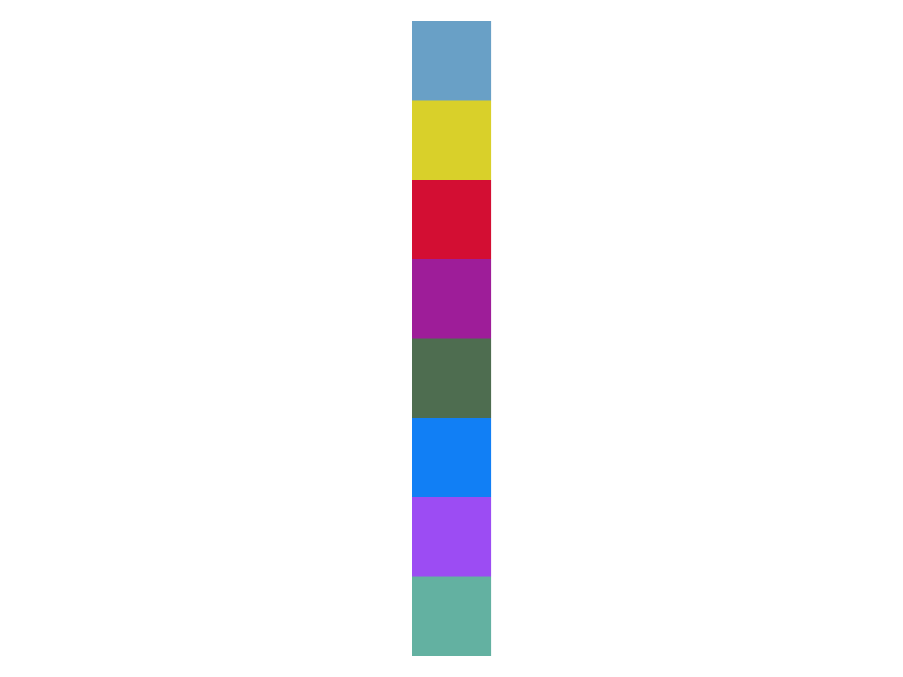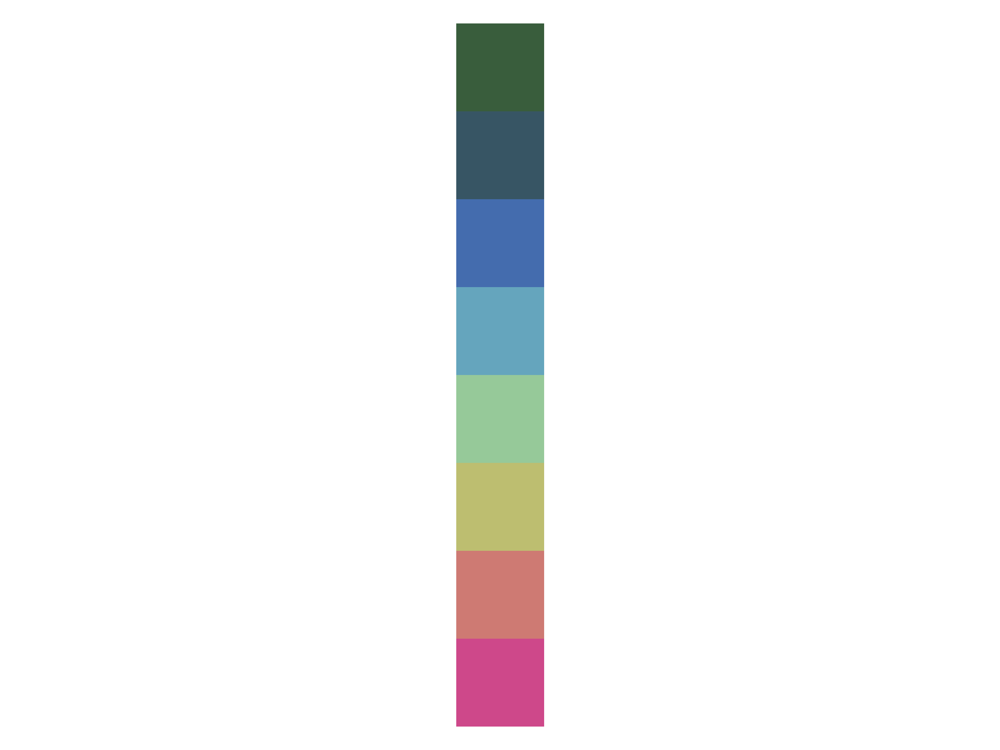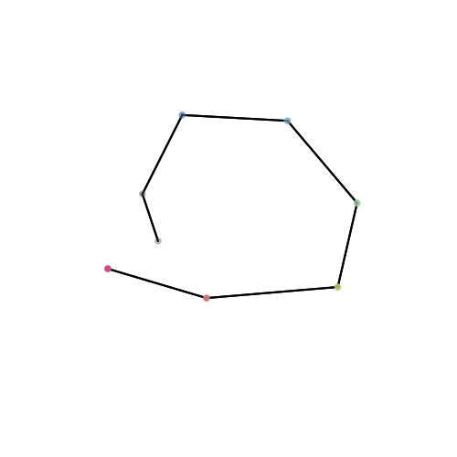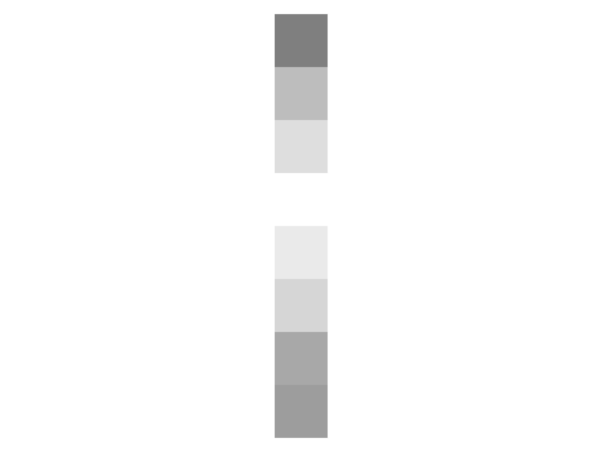

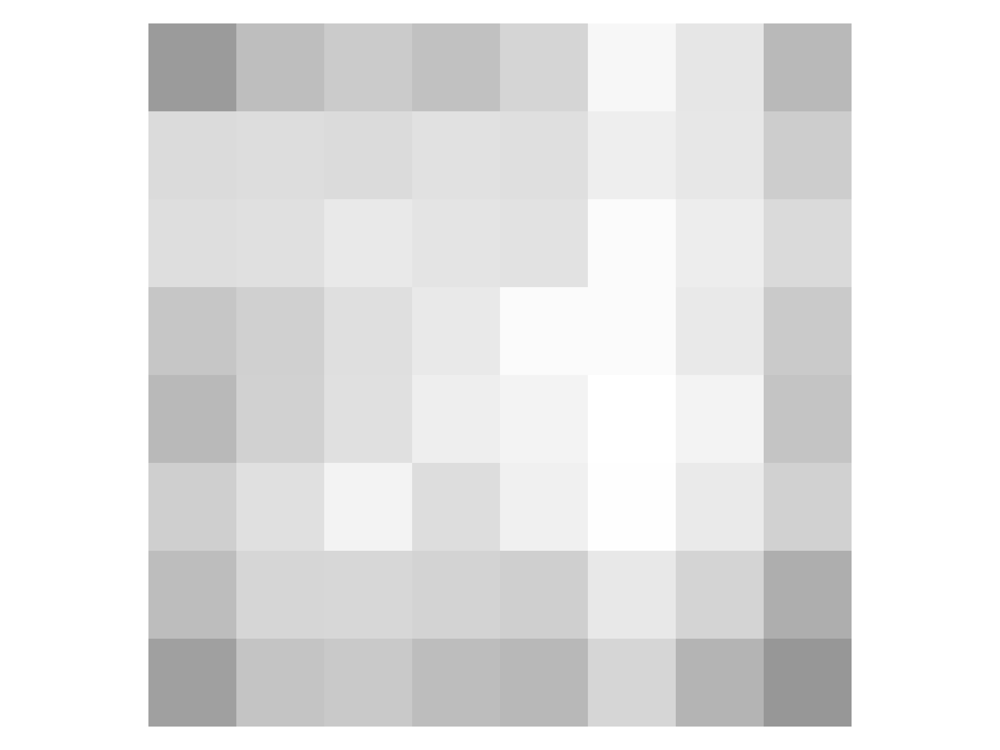

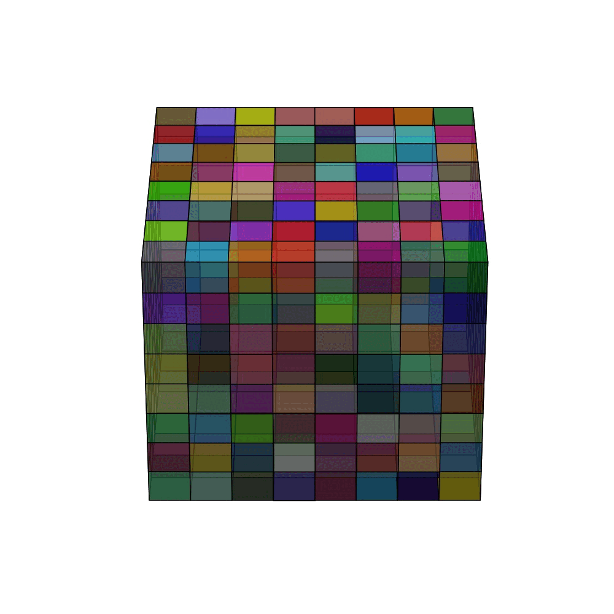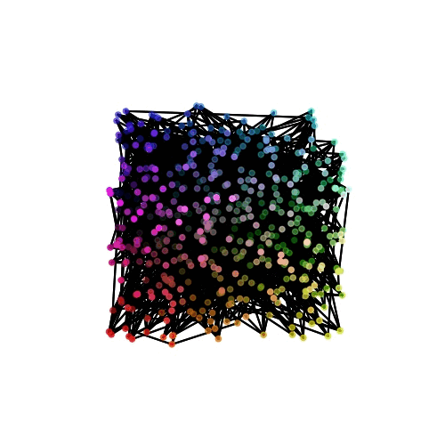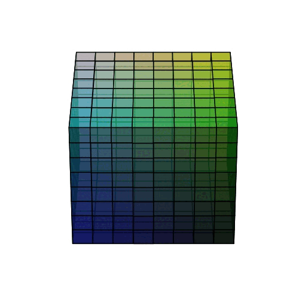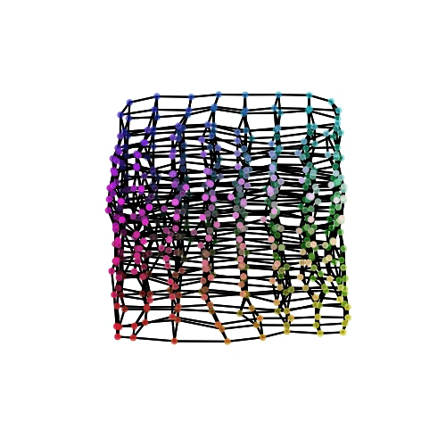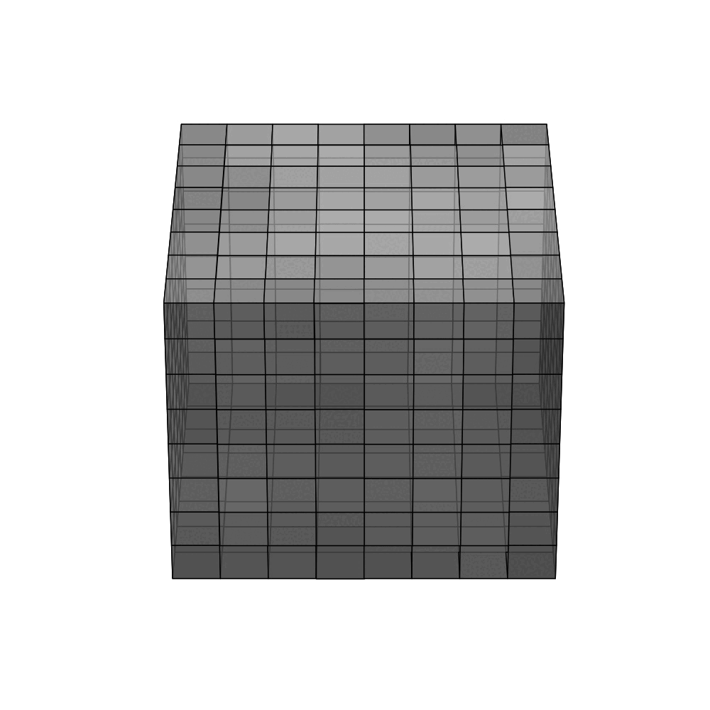

### TODOS
- [x] Initial Commit
- [ ] Add Hexagonal Topology

